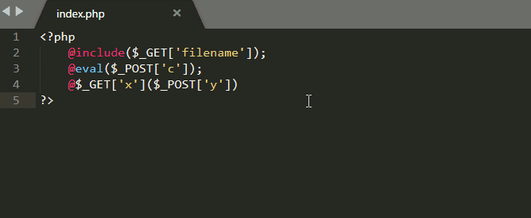

# Find-PHP-Vulnerabilities
A plug-in of sublime 2/3 which is able to find PHP vulnerabilities

#### Install:
```
1. Open "Package Control: Install Package"
2. Type package name: "Find PHP Vulnerability"
3. Press Enter to install
```

#### Usage:
```
1. Open vulnable php file
2. Press key: CTRL + ALT + P
```

#### Example:


#### TODO:
- [ ] Multifile search

#### Acknowledgement
```
Seay 源代码审计工具
```
